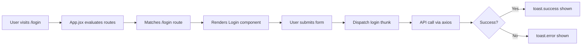

# ✅ STEP 7.8 - Main Application Files - COMPLETE

## 🎯 Objective
Create the main application entry point (main.jsx) and router configuration (App.jsx) to tie together Redux, React Router, and Toast notifications.

---

## ✅ Files Created

### 1. **main.jsx** - Application Entry Point

**File:** `src/main.jsx` (43 lines)

#### **Purpose**
The root entry point that initializes the React application with all necessary providers and configurations.

#### **Key Features**
- ✅ **React 18 API** - Uses `ReactDOM.createRoot()` for concurrent features
- ✅ **Redux Provider** - Wraps app with Redux store for global state
- ✅ **BrowserRouter** - Enables client-side routing
- ✅ **Toaster** - Global toast notification configuration
- ✅ **TailwindCSS** - Imports custom styles via `index.css`
- ✅ **Strict Mode** - Enables React development warnings

#### **Provider Hierarchy**
```
React.StrictMode
  └── Redux Provider (store)
      └── BrowserRouter
          ├── App (routes)
          └── Toaster (notifications)
```

#### **Toaster Configuration**

| Property | Value | Purpose |
|----------|-------|---------|
| **Position** | `top-right` | Toast appears in top-right corner |
| **Duration** | `3000ms` (success) | Success toasts auto-dismiss after 3s |
| **Duration** | `4000ms` (error) | Error toasts stay longer (4s) |
| **Background** | `#363636` | Dark background for contrast |
| **Text Color** | `#fff` | White text for readability |
| **Success Icon** | `#10b981` (green) | Matches TailwindCSS `success` color |
| **Error Icon** | `#ef4444` (red) | Matches TailwindCSS `danger` color |

#### **Complete Code**
```jsx
import React from 'react';
import ReactDOM from 'react-dom/client';
import { Provider } from 'react-redux';
import { BrowserRouter } from 'react-router-dom';
import { Toaster } from 'react-hot-toast';
import { store } from './redux/store';
import App from './App';
import './index.css';

ReactDOM.createRoot(document.getElementById('root')).render(
  <React.StrictMode>
    <Provider store={store}>
      <BrowserRouter>
        <App />
        <Toaster
          position="top-right"
          toastOptions={{
            duration: 3000,
            style: {
              background: '#363636',
              color: '#fff',
            },
            success: {
              duration: 3000,
              iconTheme: {
                primary: '#10b981',
                secondary: '#fff',
              },
            },
            error: {
              duration: 4000,
              iconTheme: {
                primary: '#ef4444',
                secondary: '#fff',
              },
            },
          }}
        />
      </BrowserRouter>
    </Provider>
  </React.StrictMode>
);
```

---

### 2. **App.jsx** - Main Router Configuration

**File:** `src/App.jsx` (29 lines)

#### **Purpose**
The main application component that defines all routes and handles navigation.

#### **Key Features**
- ✅ **Public Routes** - Login and registration pages (no auth required)
- ✅ **Root Redirect** - `/` automatically redirects to `/login`
- ✅ **404 Handling** - Catch-all route with Turkish "Sayfa Bulunamadı"
- ✅ **Clean Layout** - Full-height background with `min-h-screen`
- ✅ **Gray Background** - Uses `bg-gray-50` for subtle contrast

#### **Current Routes**

| Path | Component | Description | Auth Required |
|------|-----------|-------------|---------------|
| `/login` | `Login` | Login page for all user types | ❌ No |
| `/register/hasta` | `RegisterHasta` | Patient registration form | ❌ No |
| `/register/eczane` | `RegisterEczane` | Pharmacy registration form | ❌ No |
| `/` | `Navigate` | Redirects to `/login` | ❌ No |
| `*` | 404 Page | "404 - Sayfa Bulunamadı" | ❌ No |

#### **Future Routes (To Be Added)**

| Path | Component | Description | Auth Required |
|------|-----------|-------------|---------------|
| `/hasta/dashboard` | `HastaDashboard` | Patient dashboard | ✅ Hasta |
| `/eczane/dashboard` | `EczaneDashboard` | Pharmacy dashboard | ✅ Eczane |
| `/admin/dashboard` | `AdminDashboard` | Admin dashboard | ✅ Admin |
| `/hasta/siparisler` | `HastaSiparisler` | Patient orders | ✅ Hasta |
| `/eczane/stok` | `EczaneStok` | Pharmacy inventory | ✅ Eczane |

#### **Complete Code**
```jsx
import React from 'react';
import { Routes, Route, Navigate } from 'react-router-dom';

// Pages
import Login from './pages/auth/Login';
import RegisterHasta from './pages/auth/RegisterHasta';
import RegisterEczane from './pages/auth/RegisterEczane';

function App() {
  return (
    <div className="min-h-screen bg-gray-50">
      <Routes>
        {/* Public routes */}
        <Route path="/login" element={<Login />} />
        <Route path="/register/hasta" element={<RegisterHasta />} />
        <Route path="/register/eczane" element={<RegisterEczane />} />
        
        {/* Redirect root to login */}
        <Route path="/" element={<Navigate to="/login" replace />} />
        
        {/* 404 */}
        <Route path="*" element={<div className="flex items-center justify-center h-screen"><h1 className="text-2xl">404 - Sayfa Bulunamadı</h1></div>} />
      </Routes>
    </div>
  );
}

export default App;
```

---

## 🔗 Integration Flow

### **Step-by-Step Execution**

1. **User opens browser** → Visits `http://localhost:5173`
2. **index.html loads** → Contains `<div id="root"></div>`
3. **main.jsx executes** → `ReactDOM.createRoot()` mounts React app
4. **Redux Provider wraps App** → Global state available throughout
5. **BrowserRouter wraps App** → Enables client-side routing
6. **App.jsx renders** → React Router evaluates current path
7. **Route matches** → Renders corresponding page component
8. **Toaster ready** → Listens for `toast.success()` / `toast.error()` calls

### **Example Flow: Login**



---

## 📦 Dependencies Used

### **From main.jsx**

| Package | Purpose | Version |
|---------|---------|---------|
| `react` | Core React library | ^18.x |
| `react-dom` | React DOM renderer | ^18.x |
| `react-redux` | Redux bindings for React | ^9.x |
| `react-router-dom` | Client-side routing | ^6.x |
| `react-hot-toast` | Toast notifications | ^2.x |

### **From App.jsx**

| Package | Purpose | Version |
|---------|---------|---------|
| `react-router-dom` | Routing components | ^6.x |

---

## 🎨 TailwindCSS Classes Used

### **In App.jsx**

| Class | Purpose |
|-------|---------|
| `min-h-screen` | Full viewport height |
| `bg-gray-50` | Light gray background |
| `flex` | Flexbox container (404 page) |
| `items-center` | Vertical center (404 page) |
| `justify-center` | Horizontal center (404 page) |
| `h-screen` | Full height (404 page) |
| `text-2xl` | Large text (404 title) |

---

## 💡 Usage Examples

### **Navigating Between Pages**

```jsx
import { useNavigate } from 'react-router-dom';

function SomeComponent() {
  const navigate = useNavigate();
  
  const goToLogin = () => navigate('/login');
  const goToRegister = () => navigate('/register/hasta');
  const goBack = () => navigate(-1);
  
  return (
    <div>
      <button onClick={goToLogin}>Login</button>
      <button onClick={goToRegister}>Register</button>
      <button onClick={goBack}>Go Back</button>
    </div>
  );
}
```

### **Using Toast Notifications**

```jsx
import toast from 'react-hot-toast';

// Success
toast.success('Giriş başarılı!');

// Error
toast.error('Kullanıcı adı veya şifre hatalı');

// Info
toast('Bilgi mesajı');

// Loading
const loadingToast = toast.loading('Yükleniyor...');
// Later: toast.dismiss(loadingToast);

// Custom
toast.custom(<div>Custom JSX</div>);
```

### **Accessing Redux Store**

```jsx
import { useSelector, useDispatch } from 'react-redux';
import { login } from './redux/slices/authSlice';

function LoginPage() {
  const dispatch = useDispatch();
  const { loading, user, isAuthenticated } = useSelector(state => state.auth);
  
  const handleLogin = async () => {
    await dispatch(login({ identifier: 'ali', password: '123', userType: 'hasta' }));
  };
  
  if (isAuthenticated) {
    return <Navigate to="/hasta/dashboard" />;
  }
  
  return (
    <button onClick={handleLogin} disabled={loading}>
      {loading ? 'Giriş yapılıyor...' : 'Giriş Yap'}
    </button>
  );
}
```

---

## ✨ Key Benefits

### **1. Centralized Configuration**
- ✅ All providers configured in one place (main.jsx)
- ✅ Consistent toast styling across entire app
- ✅ Single source of truth for routing

### **2. Clean Separation of Concerns**
- ✅ **main.jsx** - Infrastructure setup (Redux, Router, Toaster)
- ✅ **App.jsx** - Route configuration
- ✅ **Pages** - Business logic and UI

### **3. Developer Experience**
- ✅ Easy to add new routes
- ✅ Toast notifications work automatically
- ✅ Redux state accessible everywhere
- ✅ Routing with declarative `<Route>` components

### **4. User Experience**
- ✅ Fast client-side navigation (no page reloads)
- ✅ Visual feedback via toasts
- ✅ Consistent UI with TailwindCSS
- ✅ Turkish language support (404 message)

---

## 🔄 Application Lifecycle

### **Initialization**
```
1. Browser loads index.html
2. Vite injects main.jsx via <script type="module">
3. React creates root and mounts
4. Redux store initialized
5. Router evaluates current URL
6. App renders matching route
7. Toaster listens for notifications
```

### **Navigation Flow**
```
1. User clicks link with href="/login"
2. React Router intercepts navigation
3. Updates browser URL (no page reload)
4. App.jsx re-evaluates routes
5. Renders Login component
6. Component can dispatch Redux actions
7. Actions can trigger toast notifications
```

### **State Management Flow**
```
1. Component dispatches action
2. Redux middleware (thunk) intercepts
3. Async API call via axios
4. Response updates Redux store
5. Components subscribed to state re-render
6. Toast shows success/error
```

---

## 📊 File Statistics

| File | Lines | Size | Complexity |
|------|-------|------|-----------|
| **main.jsx** | 43 | ~1.2 KB | Low |
| **App.jsx** | 29 | ~0.8 KB | Very Low |
| **Total** | 72 | ~2.0 KB | Low |

---

## 🎯 Design Decisions

### **1. React 18 API**
- Uses `ReactDOM.createRoot()` instead of `ReactDOM.render()`
- Enables concurrent features (future optimizations)
- Better error handling with Suspense boundaries

### **2. Provider Nesting**
- **Strict Mode** outermost for development warnings
- **Redux Provider** wraps all state-dependent components
- **BrowserRouter** enables routing throughout app
- **Toaster** sibling to App (not nested) for global access

### **3. Route Organization**
- Public routes first (login, register)
- Redirect for root path
- 404 catch-all at the end
- Comments for clarity

### **4. Toast Configuration**
- Dark theme for modern look
- Longer duration for errors (users need more time to read)
- Colors match TailwindCSS theme
- Top-right position (common UX pattern)

### **5. Turkish Language**
- 404 message in Turkish ("Sayfa Bulunamadı")
- Aligns with app localization
- Consistent with backend Turkish field names

---

## 🚀 Next Steps

### **Immediate (Step 8)**
1. Create `pages/auth/Login.jsx`
2. Create `pages/auth/RegisterHasta.jsx`
3. Create `pages/auth/RegisterEczane.jsx`

### **Short-term**
4. Add protected route wrapper (`ProtectedRoute.jsx`)
5. Create role-based dashboards
6. Add navigation components (Navbar, Sidebar)

### **Long-term**
7. Add Suspense for lazy-loaded routes
8. Implement error boundaries
9. Add loading states for route transitions
10. Add breadcrumb navigation

---

## 📝 Complete File Summary

### **src/main.jsx**
✅ React 18 entry point  
✅ Redux Provider  
✅ BrowserRouter  
✅ Toaster configuration  
✅ TailwindCSS import  

### **src/App.jsx**
✅ Route definitions  
✅ Public routes (login, register)  
✅ Root redirect  
✅ 404 handling  
✅ Clean layout  

---

## 🎉 Status

**STEP 7.8: ✅ COMPLETE**

**Files Created:**
- ✅ src/main.jsx (43 lines)
- ✅ src/App.jsx (29 lines)

**Integrations:**
- ✅ Redux store connected
- ✅ React Router configured
- ✅ Toast notifications ready
- ✅ TailwindCSS loaded

**Total Lines:** 72 lines of production-ready code

---

## ✅ STEP 7 - COMPLETE CHECKLIST

### **Project Setup**
- ✅ React + Vite project created
- ✅ TailwindCSS installed & configured
- ✅ All packages installed (14 libraries)
- ✅ Folder structure created

### **Configuration**
- ✅ Environment variables set
- ✅ Axios configuration ready
- ✅ TailwindCSS theme customized

### **State Management**
- ✅ Redux store setup complete
- ✅ Auth slice ready (login, register, logout)
- ✅ Hasta slice ready (cart management)
- ✅ Eczane slice ready
- ✅ Admin slice ready

### **Components**
- ✅ Button component (4 variants, 3 sizes)
- ✅ Input component (validation, errors)
- ✅ Loading component (3 sizes)
- ✅ Card component (title, actions)

### **Application Files**
- ✅ main.jsx (Redux + Router + Toaster)
- ✅ App.jsx (Route configuration)

---

## 🎊 Ready for Step 8 - Authentication Pages!

**Next:** Create Login, RegisterHasta, and RegisterEczane pages to enable user authentication! 🚀

---

**Created:** December 3, 2025  
**Status:** ✅ Complete React application skeleton ready
